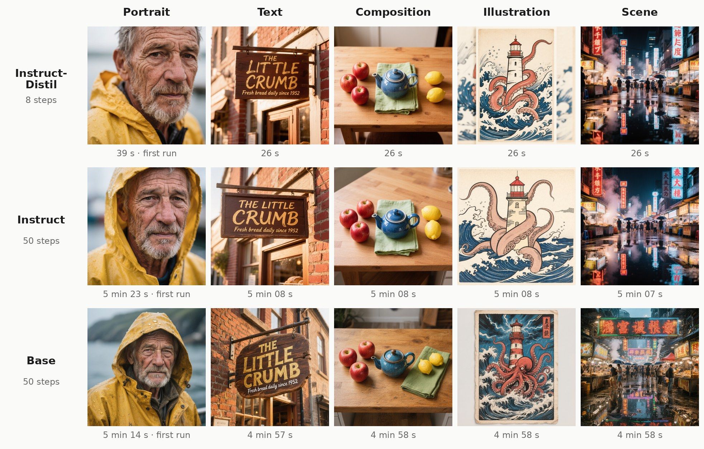
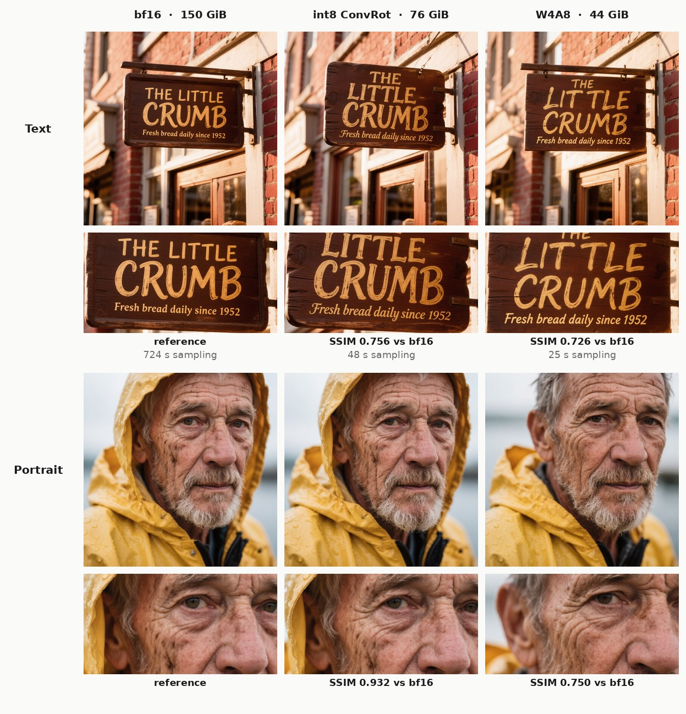
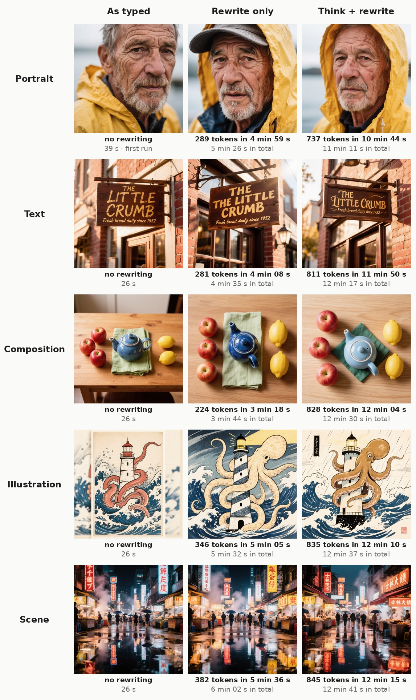
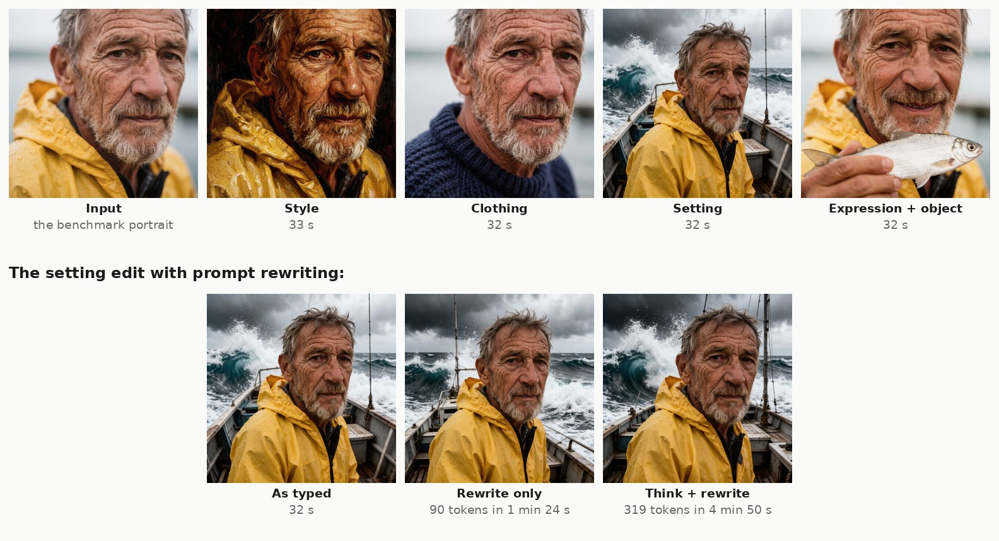
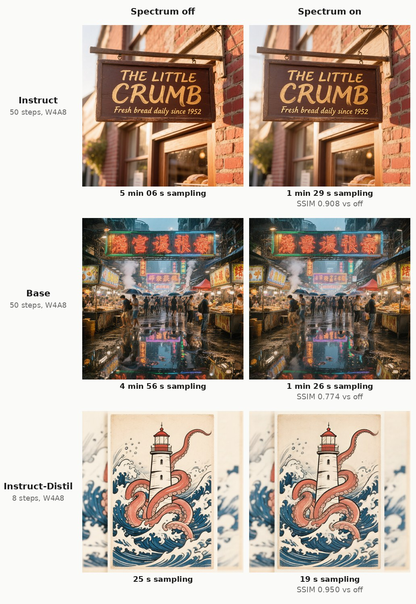

# ComfyUI-HunyuanImage3

Run Tencent's **[HunyuanImage-3.0](https://huggingface.co/tencent/HunyuanImage-3.0)**, an 80-billion-parameter
image model, **natively in ComfyUI on a single 24 GB GPU**. Use the normal KSampler, the normal VAE Decode
and ComfyUI's own memory management, with no Python wrapper around someone else's pipeline.



<sub>Instruct-Distil, Instruct and Base with W4A8 weights, 1024×1024 on one RTX 4090, same seed per prompt. The
time under each image is the whole generation; each row's first image also includes loading the model.</sub>

**[Compare every image side by side →](https://pedromarinhodev.github.io/ComfyUI-HunyuanImage3/)** all three models, all three weight formats, Spectrum off and on.

## What you get

- **All three HunyuanImage-3.0 models**: the fast 8-step **Instruct-Distil**, the full **Instruct**, and the
  pretrained **Base**.
- **Text-to-image**, **image editing** ("turn this photo into a watercolor") and **multi-image fusion**
  (combine up to three images).
- **Prompt rewriting**: the model can expand a short prompt into a detailed one before drawing.
- **Spectrum**: an optional speed-up that makes the 50-step models about **3.4× faster**, at the cost of some
  drift from the full render.
- **Ready-made weights** in three sizes (W4A8, int8, bf16) on HuggingFace, plus the scripts that made them.

## What you need

| | |
|---|---|
| GPU | an NVIDIA card with 12 GB or more (tested: RTX 4090, RTX 3090, and 16 GB / 12 GB limits, see [smaller GPUs](#smaller-gpus)) |
| System RAM | a lot. The model streams its weights from RAM every step. With the W4A8 file loaded, ComfyUI held about 50 GB (tested on a 188 GB machine) |
| Disk | 45 GB for the recommended W4A8 file, on a fast SSD |
| ComfyUI | a current version. Tested with its dynamic VRAM streaming (`comfy-aimdo`), which is what makes a single consumer card practical |

HunyuanImage-3.0 is a *mixture-of-experts* model: 80B parameters in total, 13B used per step. Only a slice fits
on the GPU at any time, so the rest streams from system RAM over PCIe on every step. That's why RAM and bus
speed matter more here than for most models, and why a smaller GPU costs surprisingly little.

## Install

```bash
cd ComfyUI/custom_nodes
git clone https://github.com/PedroMarinhoDev/ComfyUI-HunyuanImage3
```

Restart ComfyUI. There's nothing to `pip install`: the nodes only use what ComfyUI already has.

## Download the weights

**Start with the Instruct-Distil in W4A8.** It's the default in this pack and the lightest way to run the
model: 8 steps with one pass each, so about **26 s per image** where the other two take about 5 minutes, and at
44 GB it's the smallest download and the easiest on your system RAM. It does everything the Instruct does
(editing, multi-image fusion, prompt rewriting). Reach for the others when you want something specific:

| Model | HuggingFace | Best for |
|---|---|---|
| **Instruct-Distil** (default) | [PedroMarinhoDev/HunyuanImage-3.0-Instruct-Distil-ComfyUI](https://huggingface.co/PedroMarinhoDev/HunyuanImage-3.0-Instruct-Distil-ComfyUI) | everyday use: 8 steps, ~26 s per image, editing and prompt rewriting |
| **Instruct** | [PedroMarinhoDev/HunyuanImage-3.0-Instruct-ComfyUI](https://huggingface.co/PedroMarinhoDev/HunyuanImage-3.0-Instruct-ComfyUI) | the full 50-step model, with classic CFG and a step count you choose |
| **Base** | [PedroMarinhoDev/HunyuanImage-3.0-Base-ComfyUI](https://huggingface.co/PedroMarinhoDev/HunyuanImage-3.0-Base-ComfyUI) | plain text-to-image from the pretrained model, strong photographic detail |

All three need the same GPU and the same memory for a given format: the weight format, not the model, is what
sets the RAM you need. From the repo you picked, download:

| File | Put it in |
|---|---|
| `hunyuan_image_3_<model>_w4a8.safetensors` (~44 GB, recommended) | `ComfyUI/models/diffusion_models/` |
| `vae/hunyuan_image_3_vae_fp16.safetensors` | `ComfyUI/models/vae/` |
| `clip_vision/hunyuan_image_3_<model>_siglip2_so400m_naflex.safetensors` | `ComfyUI/models/clip_vision/` (only for image editing) |
| `hunyuan_image_3_<model>_cot_head.safetensors` (1 GB) | `ComfyUI/models/diffusion_models/` (only for prompt rewriting) |

Every workflow has a **Read me** note listing exactly these files, with links. The model's `config.json` and
`tokenizer.json` ship with the nodes, so there's nothing else to download.

**Which format?**



<sub>Instruct-Distil, same prompt and seed in each row, only the weight format changes. The strip under each
image is a zoom on the finest detail.</sub>

| Format | Size | Speed | When to use it |
|---|---|---|---|
| **W4A8** | 44 GB | fastest | the default: 4-bit weights, 8-bit activations |
| **int8 ConvRot** | 76 GB | ~1.9× slower per step | 8-bit weights, closest to the original that still fits the streaming budget |
| **bf16** | 150 GB | slowest | the unquantized reference (bit-identical to Tencent's weights), mainly for comparisons |

How far the quantized weights are from the originals, and how far the images move:

<!-- bench:quant:start -->
| Format | File size | Weight error vs bf16 | Cosine similarity | Image SSIM vs bf16 |
|---|---|---|---|---|
| bf16 | 150 GiB | — (reference) | 1 | 1 |
| int8 ConvRot | 76 GiB | 1.0 % | 0.99995 | 0.844 |
| W4A8 | 44 GiB | 7.3 % | 0.99732 | 0.738 |
<!-- bench:quant:end -->

*Weight error* is the relative difference between the quantized weights and Tencent's bf16 weights, and
*cosine* how closely they point the same way (1 = identical), over 5 layers spread through the model and 8
experts in each. Everything that isn't quantized (embeddings, norms, the router) is byte-identical to bf16.
*Image SSIM* compares the rendered images with the bf16 one (1 = identical pixels). At the same seed even small
weight differences can shift the composition a little, as in the portrait, so SSIM measures "same picture", not
"same quality".

The text "head" that prompt rewriting uses lives in its own `cot_head` file, so the model files don't carry
1 GB that most images never use.

## Your first image

1. Drag a workflow from [`workflows/`](workflows) into ComfyUI:

   | Workflow | Model | Task |
   |---|---|---|
   | `hunyuan_image_3_instruct_distil_txt2img.json` | Instruct-Distil | text to image (start here) |
   | `hunyuan_image_3_instruct_distil_img2img.json` | Instruct-Distil | editing, 1 to 3 input images |
   | `hunyuan_image_3_instruct_txt2img.json` | Instruct | text to image |
   | `hunyuan_image_3_instruct_img2img.json` | Instruct | editing, 1 to 3 input images |
   | `hunyuan_image_3_base_txt2img.json` | Base | text to image |

2. In **Load HunyuanImage 3.0 Model**, pick your file. The node recognizes which of the three models it is
   from the weights themselves, so there's nothing else to set.
3. Write a prompt and queue it. The workflows already carry each model's settings:

   | Model | Steps | cfg | Notes |
   |---|---|---|---|
   | Instruct-Distil | 8 | 1.0 | keep the **Guidance** node at 2.5 |
   | Instruct | 50 | 2.5 | |
   | Base | 50 | 5.0 | |

   Always use the `euler` sampler with the `simple` scheduler. The encoders make the negative prompt
   themselves (the model's own "empty" prompt), so there's no second text box to fill.

**Image size.** The model was trained at about 1 megapixel, in 37 shapes from 2048×512 to 512×2048
(pick one in **HunyuanImage 3.0 Resolutions**). Custom sizes up to about 1536×1536 work. Much larger, like
2048×2048, is beyond what the model can do and comes out garbled; for big images, generate at 1024 and upscale.

## Speed

Measured on one **RTX 4090** (PCIe 4.0 ×8, 188 GB RAM), 1024×1024, with the settings in the workflows:

<!-- bench:speed:start -->
| Model | Format | First image (cold) | Next images (warm) | Per step | Warm, Spectrum on |
|---|---|---|---|---|---|
| Instruct-Distil (8 steps) | W4A8 | 39 s | 26 s | 3.1 s | 20 s |
| Instruct-Distil (8 steps) | int8 ConvRot | 1 min 10 s | 49 s | 5.9 s | 37 s |
| Instruct-Distil (8 steps) | bf16 | 12 min 36 s | 12 min 06 s | 90.3 s | — |
| Instruct (50 steps) | W4A8 | 5 min 23 s | 5 min 08 s | 6.1 s | 1 min 30 s |
| Instruct (50 steps) | int8 ConvRot | 9 min 48 s | 9 min 50 s | 11.8 s | 2 min 48 s |
| Base (50 steps) | W4A8 | 5 min 14 s | 4 min 58 s | 5.9 s | 1 min 27 s |
| Base (50 steps) | int8 ConvRot | 10 min 13 s | 9 min 50 s | 11.8 s | 2 min 48 s |
<!-- bench:speed:end -->

- **Cold** is the first image after you queue a workflow with a model that isn't loaded yet: it includes loading
  the weights and moving them onto the GPU. **Warm** is every image after that, with the model already in
  memory. (The loader node itself only maps the file, which takes under a second; the loading shows up in the
  first sampling step.) Right after a reboot, when the file isn't in your system's file cache, the first image
  takes longer still, because the weights come off the disk.
- **Text encoding costs nothing** without prompt rewriting: it only turns the prompt into tokens. **VAE decode**
  takes about 1.2 s.
- **Instruct and Base run two passes per step** (your prompt and the model's negative), which is why their
  steps take about twice as long as the Instruct-Distil's.
- **bf16** was only rendered for the Instruct-Distil, as the reference for the quantized formats. Its 154 GB
  didn't fit in the RAM left over on this 188 GB machine, so it streamed from an NVMe drive at about 1 GB/s,
  which is what its ~90 s per step shows. In an earlier run with more RAM free it took about 15 s per step.
  Either way, bf16 is for comparisons, not for everyday use.

### Smaller GPUs

The Instruct-Distil W4A8 also runs on 16 GB and 12 GB of VRAM. Measured on the same RTX 4090 with the rest of its
memory held by another process, so ComfyUI could only use 16 GB or 12 GB; 1024×1024, 8 steps:

| VRAM | First image (cold) | Next images (warm) | Per step | ComfyUI's peak VRAM |
|---|---|---|---|---|
| 24 GB | 39 s | 26 s | 3.1 s | — |
| 16 GB | 47 s | 30 s | 3.5 s | 15.9 GB |
| 12 GB | 47 s | 32 s | 3.7 s | 11.6 GB |

The images are identical to the 24 GB ones. The weights stream from **system RAM**, not from disk: the disk is
read once, when the first image loads the model, and never after. So a smaller card still needs the same ~50 GB
of free RAM, and a slower card than this 4090 (less compute, a narrower PCIe link) will be slower than the table.

<details>
<summary>Every stage, cold and warm</summary>

<!-- bench:stages:start -->
| Model | Format | Run | Load model | Text encode | Sampling | VAE decode | Total |
|---|---|---|---|---|---|---|---|
| Instruct-Distil | W4A8 | cold | 0.6 s | 0.00 s | 37 s | 1.4 s | 39 s |
| Instruct-Distil | W4A8 | warm | 0.0 s | 0.00 s | 25 s | 1.2 s | 26 s |
| Instruct-Distil | int8 ConvRot | cold | 0.3 s | 0.00 s | 1 min 08 s | 1.2 s | 1 min 10 s |
| Instruct-Distil | int8 ConvRot | warm | 0.0 s | 0.00 s | 47 s | 1.1 s | 49 s |
| Instruct-Distil | bf16 | cold | 0.2 s | 0.00 s | 12 min 34 s | 1.5 s | 12 min 36 s |
| Instruct-Distil | bf16 | warm | 0.0 s | 0.00 s | 12 min 04 s | 1.4 s | 12 min 06 s |
| Instruct | W4A8 | cold | 0.7 s | 0.00 s | 5 min 21 s | 1.5 s | 5 min 23 s |
| Instruct | W4A8 | warm | 0.0 s | 0.00 s | 5 min 06 s | 1.2 s | 5 min 08 s |
| Instruct | int8 ConvRot | cold | 0.3 s | 0.00 s | 9 min 46 s | 1.2 s | 9 min 48 s |
| Instruct | int8 ConvRot | warm | 0.0 s | 0.00 s | 9 min 49 s | 1.1 s | 9 min 50 s |
| Base | W4A8 | cold | 1.3 s | 0.00 s | 5 min 10 s | 1.2 s | 5 min 14 s |
| Base | W4A8 | warm | 0.0 s | 0.00 s | 4 min 56 s | 1.2 s | 4 min 58 s |
| Base | int8 ConvRot | cold | 0.4 s | 0.00 s | 10 min 11 s | 1.1 s | 10 min 13 s |
| Base | int8 ConvRot | warm | 0.0 s | 0.00 s | 9 min 48 s | 1.1 s | 9 min 50 s |
<!-- bench:stages:end -->

</details>

## Prompt rewriting

Connect a **HunyuanImage 3.0 Prompt Rewriting** node to the `prompt_rewriting` input of a Text Encode or Image
Encode node, and the model first rewrites your prompt into a detailed description, then draws that. The
rewritten text comes out of the encoder's `rewritten_prompt` output. The workflows include the node, switched
off: set `enabled` to true to use it.



<sub>Instruct-Distil, W4A8, same image seed in each row. The first line under each image is the rewriting stage
(tokens it wrote and how long that took), the second the whole generation. The rewritten prompts and the model's
reasoning are on the [comparison page](https://pedromarinhodev.github.io/ComfyUI-HunyuanImage3/).</sub>

- `mode`: **rewrite only** (default, a few hundred tokens) or **think + rewrite** (writes its reasoning
  first, often 1000+ tokens).
- It's slow: about **1 second per token** (0.8–0.9 s measured), so a typical rewrite of ~300 tokens takes
  **4–5 minutes**. The text model has to stream its experts for every single token.
- When editing, the rewrite is written *looking at your images*, as in Tencent's own pipeline.
- It needs the model's `cot_head` file in `models/diffusion_models`. `cot_head: auto` finds the right one.
- It works with Instruct and Instruct-Distil. The Base model wasn't trained for it.
- The rewrite has its own `seed`, fixed by default, so changing the image seed doesn't redo it.

## Image editing and multi-image fusion

Use **HunyuanImage 3.0 Image Encode** (or the `_img2img` workflows): connect your image, the VAE and the
model's `clip_vision` file, and describe the change.



<sub>Instruct-Distil, W4A8, 8 steps. The instructions are on the [comparison page](https://pedromarinhodev.github.io/ComfyUI-HunyuanImage3/). The bottom row
repeats the setting edit with prompt rewriting, which reads the input image before rewriting the instruction.</sub>

- **Up to three images.** A new `image` socket appears each time you connect one. Refer to them in the prompt
  as "the first image", "the second image" and so on ("put the cat from the first image on the sofa in the
  second image").
- Each input image is resized to about 1 megapixel, as Tencent's pipeline does.
- The output size is whatever you wire into `width`/`height`. The workflows use the first image's shape at
  about 1 megapixel (**Scale Image to Total Pixels → Get Image Size**); a **Resolutions** node gives a fixed size.
- `vit_strength` and `latent_strength` (both 1.0 by default) tune how strongly the input images steer the
  result.
- Each extra image makes every step slower, since the model reads all of them at every step.

## Spectrum: up to 3.4× faster sampling

Put **HunyuanImage-3.0 Spectrum** between the model loader and the KSampler, and set `enabled` to true (the
workflows already include it, switched off). On some steps it skips the model's heavy core and *predicts* its
output from the steps that did run ([Spectrum, CVPR 2026](https://github.com/hanjq17/Spectrum)).



<!-- bench:spectrum:start -->
| Model | Warm image, Spectrum off | Spectrum on | Faster by | Similarity to Spectrum off (SSIM, 5 prompts) |
|---|---|---|---|---|
| Instruct-Distil (8 steps) | 26 s | 20 s | 1.3× | 0.959 (lowest 0.945) |
| Instruct (50 steps) | 5 min 08 s | 1 min 30 s | 3.4× | 0.878 (lowest 0.752) |
| Base (50 steps) | 4 min 58 s | 1 min 27 s | 3.4× | 0.830 (lowest 0.739) |
<!-- bench:spectrum:end -->

It pays off on the 50-step models: about 3.4× faster, at the cost of details and sometimes layout drifting from
the full render (the SSIM column: 1 would be identical). On the 8-step Instruct-Distil there are too few steps to skip,
so it saves only a few seconds, and the image stays very close. The defaults follow the paper; `flex_window`
trades speed for fidelity.

## Nodes

| Node | What it does |
|---|---|
| **Load HunyuanImage 3.0 Model** | loads a checkpoint and detects which model it is |
| **HunyuanImage 3.0 Text Encode** | prompt → positive and negative conditioning, for text to image |
| **HunyuanImage 3.0 Image Encode** | prompt + 1 to 3 images → positive and negative conditioning, for editing |
| **HunyuanImage 3.0 Prompt Rewriting** | lets the model rewrite the prompt first; plugs into either encoder |
| **HunyuanImage 3.0 Guidance** | the Instruct-Distil's built-in guidance strength (it samples at cfg 1.0) |
| **HunyuanImage 3.0 Resolutions** | the model's 37 native sizes |
| **HunyuanImage 3.0 Empty Latent** | an empty latent of the right shape |
| **Load HunyuanImage-3.0 VAE** | the model's VAE (the stock VAE loader misdetects it) |
| **HunyuanImage-3.0 Spectrum** | optional speed-up, see above |

Both encoders use each model's built-in system prompt. To use your own, connect any text to their optional
`custom_system_prompt` input.

Everything else is stock ComfyUI: KSampler, VAE Decode, Save Image, Select Model Device for multi-GPU.

## How it runs on 24 GB

- **Streaming, ComfyUI-native.** Weights stay in system RAM and move to the GPU as each layer needs them,
  through ComfyUI's dynamic VRAM system.
- **Layer lookahead.** While one layer computes, the next layer's weights are already being copied, which
  makes each step about 30% faster.
- **Per-expert fetching for text.** When rewriting a prompt, only the 8 experts each token uses are copied,
  not all 64 (21× faster than the naive way).
- **Quantization.** W4A8 stores the expert weights in 4 bits with rotation (ConvRot) and per-expert
  codebooks, so each step moves ~45 GB instead of ~150 GB.

## Make the weights yourself

`tools/convert_all.py` builds every file from Tencent's original release:

```bash
python tools/convert_all.py --model distil --weights /path/to/HunyuanImage-3.0-Instruct-Distil \
    --out-dir ComfyUI/models/diffusion_models --clip-vision-dir ComfyUI/models/clip_vision \
    --formats w4a8,int8,bf16,head,vision --device cuda:0
```

Run it with ComfyUI's Python and `PYTHONPATH` pointing at your ComfyUI folder. Quantizing needs a CUDA GPU
and ~45 GB of free RAM. Existing outputs are skipped, so an interrupted run can simply be restarted.

## Troubleshooting

- **Wrong-looking or noisy images**: use `euler` + `simple` with the step/cfg values above.
- **A workflow from the first release shows red nodes**: the nodes were redesigned (separate Image Encode and
  Prompt Rewriting nodes, no `model_type`). Start from the new workflows in [`workflows/`](workflows).
- **"Missing VAE keys … temb_proj" in the log**: harmless, printed while the VAE loads.
- **The VAE isn't found after updating**: it's now `hunyuan_image_3_vae_fp16.safetensors`, one file for all
  three models.
- **Out of memory / very slow**: close other GPU apps; W4A8 needs the least RAM and VRAM.
- **Prompt rewriting returns nothing**: you're on the Base model, or the token budget ran out: raise
  `max_new_tokens` to 512–768.
- **"prompt rewriting needs the … text head"**: download that model's `cot_head` file into
  `models/diffusion_models`.
- **An edit looks overbaked or oversaturated**: use a different seed than the one that made the input image.
  Re-using it pushes the result too far.

## License

- **Code**: GPL-3.0 ([LICENSE](LICENSE)). Parts of the model code are adapted from Tencent's reference
  implementation of HunyuanImage-3.0, which remains under the Tencent Hunyuan Community License. The
  Spectrum forecaster is adapted from [hanjq17/Spectrum](https://github.com/hanjq17/Spectrum) (MIT). See
  [NOTICE](NOTICE).
- **Weights**: the [Tencent Hunyuan Community License](https://huggingface.co/tencent/HunyuanImage-3.0/blob/main/LICENSE).
  **It doesn't apply in the European Union, the United Kingdom or South Korea**, and it includes an
  Acceptable Use Policy.

## Credits

[Tencent Hunyuan](https://github.com/Tencent-Hunyuan/HunyuanImage-3.0) for HunyuanImage-3.0 ·
[Spectrum](https://github.com/hanjq17/Spectrum) by Han et al. · [ComfyUI](https://github.com/comfyanonymous/ComfyUI).
